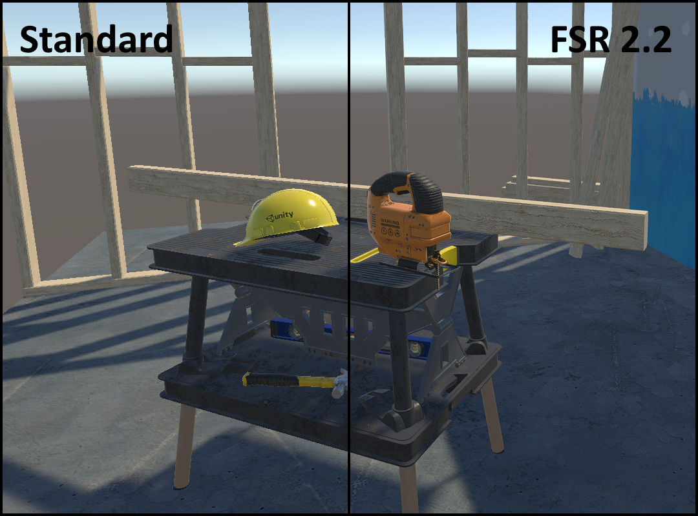
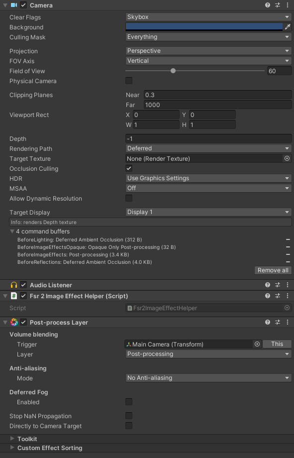
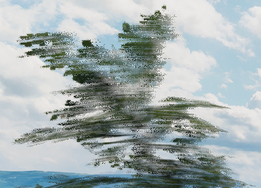
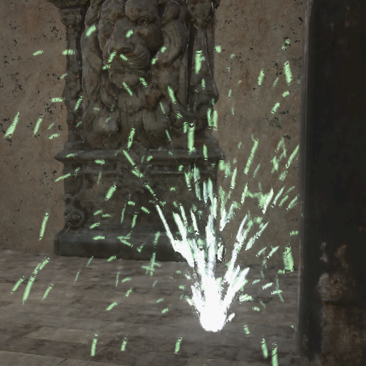
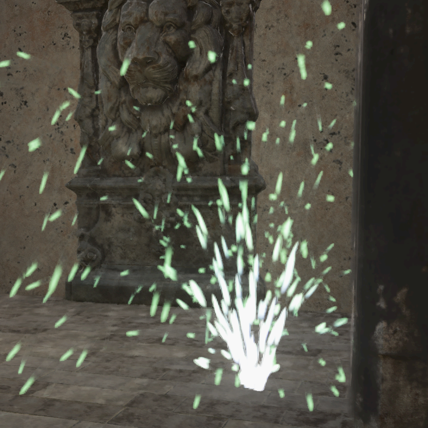
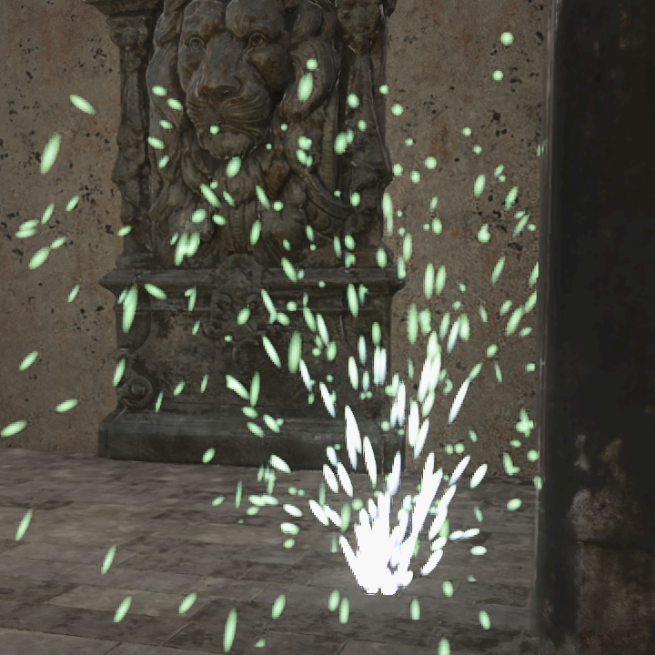

# FSR 2.2 for Unity

FidelityFX Super Resolution 2 (FSR2) is an advanced image upscaling and temporal reconstruction technique developed by AMD and [released as open source](https://github.com/GPUOpen-Effects/FidelityFX-FSR2). It provides both high-quality anti-aliasing and the ability for games to output at high resolutions while rendering at a lower internal resolution, improving performance.

This project aims to bring FSR2 to Unity, as an alternative to Unity's existing FXAA, SMAA and TAA anti-aliasing solutions. Compared to Unity's TAA implementation, FSR2 offers a sharper and more stable image, with a better sub-pixel detail resolve and better performance due to its reliance on upscaling.

Rather than attempting to integrate AMD's open source C++ libraries for FSR2, this project instead reimplements the C++ backend in C# while adapting FSR2's HLSL shader code to work within Unity. This allows for maximum compatibility with the platforms and graphics APIs that Unity supports, including ones that normally wouldn't be supported by FSR2.

Focus of this project lies initially on making FSR2 work with the traditional Unity built-in render pipeline. However the core FSR2 classes are render pipeline-agnostic, so there is every possibility for URP and HDRP to be supported as well in the future.

## Table of Contents

- [Requirements](#requirements)
- [Integration](#integration)
  - [Callbacks](#callbacks)
    - [Resource management](#resource-management)
    - [Mipmap biasing](#mipmap-biasing)
  - [Motion vectors](#motion-vectors)
  - [Reactive mask](#reactive-mask)
  - [Exposure](#exposure)
- [Known issues](#known-issues)
- [Details on implementation](#details-on-implementation)
  - [Supporting unsupported platforms](#supporting-unsupported-platforms)
  - [Built-in Render Pipeline upscaling](#built-in-render-pipeline-upscaling)
  - [16-bit Floating Point support](#16-bit-floating-point-support)

## Requirements

FSR2 for Unity requires Unity 2020.1 or higher. This version of Unity added support for the `multi_compile` keyword in compute shaders, which the FSR2 implementation makes use of.

Other than the above, requirements are no different from normal FSR2: it requires a GPU with compute shader support, typed UAV load and R16G16B16A16_UNORM support. In practice, almost every GPU made in the past decade will be able to run it.

Platforms tested and confirmed working:
- Windows
    - DirectX 11
    - DirectX 12
    - Vulkan
    - OpenGL Core
- Linux
    - Vulkan
    - OpenGL Core
- MacOS
    - Metal
- Android
    - Vulkan
- iOS
    - Metal
- Xbox One
- Xbox Series X|S
- PlayStation 4
- PlayStation 5
    - Standard Graphics API
    - NGGC
- Nintendo Switch

The exact hardware requirements for mobile devices (Android and iOS) are still to be determined.

Note that OpenGL on MacOS does not support compute shaders, so it will never be able to run FSR2.

## Integration

Integration generally follows the same guidelines as the [FSR2 documentation on Github](https://github.com/GPUOpen-Effects/FidelityFX-FSR2#integration-guidelines), with a few specifics for the Unity implementation.

To apply FSR2 to a camera, simply add the `Fsr2ImageEffect` script to your camera game object. It should be placed at the bottom of the components list, to ensure that it's the last image effect in the chain.

This component contains settings for changing the scaling factor (Quality Mode), enabling or disabling various features, and for providing certain optional inputs that are further explained below.

If you have any other post-processing effects on your camera that make use of the `OnPreCull` method, then also add the `Fsr2ImageEffectHelper` script to the camera and move it up, above those other post-processing effects. Specifically: it needs to be above any script that queries the camera's viewport size properties (i.e. `rect`, `pixelRect`, `pixelWidth`/`Height`) in `OnPreCull`. Unity's `PostProcessLayer` script is a particularly good example of this.

Also make sure that any other anti-aliasing methods (MSAA, FXAA, SMAA, TAA) are disabled when enabling FSR2.

### Callbacks

FSR2 for Unity requires the application to provide a few services that it can't make any assumptions about itself. For this purpose, it exposes an `IFsr2Callbacks` interface with a default implementation `Fsr2CallbacksBase`. The application can provide these callbacks by either implementing the `IFsr2Callbacks` interface or inheriting the `Fsr2CallbacksBase` class and overriding one or more methods. Assign these callbacks to the `Callbacks` property on the `Fsr2ImageEffect` script component, before the script is enabled.

#### Resource management

By default, FSR2 for Unity loads its shaders directly from a Resources folder. This is not recommended behavior and many applications choose to manage shaders in a different way. To accomodate this, FSR2 for Unity makes it possible to override the methods by which shaders are loaded and unloaded. For example, they may be loaded from an asset bundle instead.

#### Mipmap biasing

One key part of FSR2 is adjusting the mipmap bias of textures. Normally when lowering the rendering resolution, Unity will also sample textures at lower mipmap levels to prevent texture aliasing. When upscaling is in use, this will result in noticeably blurry textures. To combat this, FSR2 suggests that applications adjust the mipmap bias for texture content in the scene that is to be upscaled. This is [further explained in the FSR2 documentation](https://github.com/GPUOpen-Effects/FidelityFX-FSR2#mipmap-biasing).

Unfortunately Unity has no single unified way to identify textures that are part of the 3D scene, nor does it offer a way to set a global mipmap bias at run-time. There are also many different ways in which textures may be applied to a scene, depending on which third-party asset packages the application chooses to use. This makes the implementation of texture mipmap biasing a highly application-specific thing.

The default implementation in `Fsr2CallbackBase` will very naively look up every `Texture2D` object in the current scene and apply the mipmap bias offset to it. This generally works fine but it will also include textures that shouldn't have the mipmap bias applied (e.g. UI textures) and potentially misses textures that should have the mipmap bias applied (e.g. texture arrays for terrain rendering). You will want to override this callback to more selectively specify the textures that need to have this mipmap bias applied, and possibly store the current mipmap bias value to retroactively apply it to assets that are loaded on demand.

### Motion vectors

FSR2 relies on depth and motion vector data to track pixels across frames and to detect areas that 'became visible' on the current frame and therefore should not be reconstructed using historical data. For all of this to work properly, it is very important that the application renders correct motion vector data for all moving objects in the scene, in addition to camera motion vectors. 

Unfortunately not all community-made Unity asset packages have gotten the message that temporal image techniques are here to stay, and either don't output motion vectors from their shaders or poorly document how this is enabled. This is not helped by Unity itself being rather obscure in how motion vectors are to be rendered and accessed.

If a moving object does not render motion vectors, you will clearly notice this as pixellated streaks appearing behind it. On small objects like individual particles this isn't a huge problem, but on things like dense foliage it will turn everything into a blurry, smeary soup.

Example of a tree waving in the wind reconstructed without motion vectors, causing visible streaking artifacts:

Again, make sure that all of your moving objects render motion vectors and complain to your third-party asset package providers if they do not.

### Reactive mask

The reactive mask is a special input texture that tells FSR2 how much of the current frame should be taken into account when reconstructing each pixel. This is important when reconstructing pixels containing transparency effects, such as glass, water or particles. Transparencies are usually not rendered to motion vectors (and even if they did it wouldn't match the opaque content behind the transparent object), so FSR2 has no way to track these pixels across frames.

Here is an example of a transparent particle effect upscaled by FSR2 without a reactive mask applied:

The particles are poorly defined with lots of streaking and pixellation artifacts.

A reactive mask can be provided in two different ways. The easiest way is to make use of the auto-generate reactive mask feature. This captures the render buffer before and after transparencies are applied, and generates a reactive mask based on the difference between the two. This is a 'broad strokes' kind of approach and how well it works depends on the specific transparency effects and how they are applied. Here's what the same particle effect looks like with the auto-generated reactive mask applied:

The artifacting is mostly gone but the particles remain somewhat blurry and streaky.

Enabling the auto-generate reactive mask feature is as simple as ticking the corresponding checkbox on the `Fsr2ImageEffect` script. This will automatically capture the opaque-only image on the `BeforeForwardAlpha` camera event and dispatch the relevant compute shader when it's time to apply FSR2 upscaling. There are various parameters available for tweaking the auto-generate process, however what these values do is rather poorly documented. The defaults should give decent results in most cases.

The other way to provide a reactive mask is by generating one yourself. Essentially, you need to have your transparent shaders output directly to a reactive mask texture with a value representing both the pixel's luminance and opacity values. The FSR2 sample does this as follows:

    output.reactiveMask = max( output.color.r, max( output.color.g, output.color.b ) ) * albedo.a;

Of course this means that you have to modify your application's shaders to output this value. The upside of this is that it will produce the most accurate and artifact-free results:

The manually generated reactive mask can be supplied to the `Fsr2ImageEffect` script through its Reactive Mask texture parameter.

### Exposure

FSR2 accepts a 1x1 input texture containing an exposure value for the current frame. Typically this exposure value is output by an eye adaptation shader, as is the case with PPV2's Auto Exposure effect. The need for this exposure value in FSR2 isn't immediately obvious, so I'll try to explain.

Imagine walking from a bright outdoors area into a dark tunnel and standing still while the camera adjusts to the darkness. Without any additional information, FSR2 will see the pixels changing as the picture becomes brighter and will attempt to temporally reconstruct the intended image. This reconstruction is visible as a slight fizzling effect, especially on lower resolutions, lower framerates and lower quality modes. In a situation like this, FSR2 needs to be told that it's not the geometry that is changing but rather the light level.

By providing FSR2 with the image's current exposure value, it can derive each pixel's original unadjusted color value and will be able to tell that the pixels are not actually changing. This results in a sharper and more stable image, without any temporal fizzling artifacts.

The exposure value can be supplied to the `Fsr2ImageEffect` script through its Exposure texture parameter. PPV2's Auto Exposure effect outputs a compatible texture, however this value is kept internal by PPV2 so it'll require some trickery to plug this into FSR2. It's also possible to allow FSR2 to compute an exposure value by itself by enabling the Auto Exposure feature, however results may vary and this feature has some issues on a couple of platforms.

## Known issues

- Enabling Auto Exposure causes artifacting on OpenGL Core.  
  It's uncertain what is causing this. Further investigation is required.  
  Workaround: disable Auto Exposure on affected platforms.
- Texture mipmap bias adjustment is not working on MacOS Metal.  
  This causes blurry textures as the internal render resolution is lowered. This is a Unity issue of some sort.  
  Workaround: no known workaround yet.

## Details on implementation

This section goes more in-depth on how the implementation of FSR2 into Unity was accomplished, as well as the rationale behind some of its design decisions. For more information on how the FSR2 algorithm itself works, see the [official documentation on Github](https://github.com/GPUOpen-Effects/FidelityFX-FSR2#the-technique).

### Supporting unsupported platforms

Officially, FSR2 only offers support for DX12 and Vulkan, with DX11 and Xbox implementations available at request for licensed developers. So how did we manage to get FSR2 working on OpenGL, MacOS and PlayStation?

FSR2 for Unity relies heavily on Unity's ability to cross-compile HLSL and translate code to other shader languages. As it turns out, FSR2's shader codebase consists largely of very straightforward and portable HLSL code. Only a few shader keywords were necessary to make these shaders compile for DX11 and OpenGL Core in Unity, with a couple of additional patches and hacks required to make them work in Metal and PSSL as well. Additionally by translating FSR2's C++ backend code to C# code using Unity's APIs, we take advantage of Unity's platform abstractions to implement compute shader dispatch and resource management for all the platforms that we want to support.

With Metal, the biggest limitation is its lack of texture atomics. FSR2's HLSL code uses three of those operations: `InterlockedAdd`, `InterlockedMin` and `InterlockedMax`. These allow values to be accumulated between multiple threads, without the risk of one thread overwriting another thread's write actions. In order to "just make it compile" I redefined these functions as simple, non-atomic code blocks. This was already enough to make FSR2 work on Metal and there were no obvious visual issues caused by this hack. It should be possible to properly reimplement these atomic functions by using a compare-and-swap technique, but I've decided to leave well enough alone for now.

For PSSL, the main missing element were type definitions for the various float and vector types that FSR2 uses. These are all defined in a single common header file (`ffx_common_types.h`) and are primarily aimed at HLSL and GLSL as expected. PSSL uses different type names so in order to make the FSR2 shaders compile for PS4/5, I added the required type definitions to this header file. Additionally, the FSR2 shader code uses two type qualifiers (`unorm` and `globallycoherent`) that PSSL doesn't understand. I simply defined these keywords as blanks, which was enough to make the shaders work. Again there is probably a proper way to redefine these keywords using PSSL equivalents, but I haven't found the correct ones yet.

These hacks mean that technically speaking, the FSR2 shaders are not 'correct' on Metal and PSSL. However during my testing I have not seen any problems or visual artifacts caused by these modifications, and the results look as good as they do on any other platform. It's certainly possible that there are issues that I haven't seen yet, particularly in applications with heavy use of high contrast colors and HDR lighting, but until I see a clear example of this I'm going to leave things as-is.

### Built-in Render Pipeline upscaling

FSR2 for Unity performs upscaling by manipulating the camera's viewport parameters ahead of rendering, then restoring them during the post-processing phase and outputting the upscaled image directly to the camera's backbuffer. This approach has several advantages and drawbacks:

Advantages:
- It's very simple and works well together with most other rendering effects.
- It doesn't add any extra rendering overhead, as you would get with a two-camera setup.
- It works without issue on all tested platforms.
- It does not cause any issues with UI rendering afterward.

Drawbacks:
- The upscaled output cannot be blitted back to the camera's target texture, it can only be blitted directly to the backbuffer.
- Consequently, FSR2 upscaling has to be the last image effect in the camera's post-processing chain.
- This makes it difficult to apply additional post-processing effects after FSR2 upscaling.

It is now possible to have FSR2 output to a camera target texture, but this is accomplished by taking over control of the target texture and removing it from the camera. This allows the upscaled output to be used as a render texture on a different camera (e.g. for UI usage), but it does not remove the limitation of FSR2 having to be the last image effect on its camera.

Initial prototypes of the upscaler used a two-camera setup with an intermediate render texture created at runtime. This approach worked, but it had several problems:
- It added a lot of complexity of having to create and manage an additional camera.
- It added extra rendering overhead; Unity cameras will always render *something* even if you tell it not to draw anything (Clear Flags set to Don't Clear, Culling Mask set to Nothing, etc) and that had a visible performance impact in the GPU profiler.
- It doesn't work well on all platforms. Particularly on Xbox One, Unity has some unsolved issues with render texture blitting when ESRAM usage is enabled. This was causing jittering artifacts when FSR2 upscaling was in use. Disabling ESRAM solved the problem, but at the cost of measurably worse rendering performance.

Unity also offers a dynamic resolution system (through `ScalableBufferManager`) which would be a good fit for upscaling techniques, but the problem there is that it's not supported on every platform. In particular DirectX 11 on Windows does not support `ScalableBufferManager`, which is a deal breaker. Additionally `ScalableBufferManager` has a long-standing issue where UI gets scaled as well, even if the UI camera is set not to allow dynamic resolution.

After looking around for alternative solutions, I came across this discussion: https://answers.unity.com/questions/1322637/best-way-to-downsample-camera-viewport.html. Using camera viewport rect manipulation turned out to be an easy, unassuming and unintrusive solution offering the best balance of platform support, performance and simplicity.

### 16-bit Floating Point support

FSR2 supports the use of half-precision floating point calculations (or FP16) by enabling the `FFX_HALF` keyword on its shaders. This allows FSR2 to take advantage of double-rate floating point operations on modern graphics cards to improve performance.

FSR2 for Unity supports enabling FP16 too, however the feature is rendered practically useless by how Unity compiles shaders. By default on most non-mobile platforms, any half-precision variables and operations are compiled as 32-bit floating point anyway by Unity's shader compiler. This means on those platforms, FSR2's shaders will behave the same regardless of whether the `FFX_HALF` keyword is enabled or not.

There are some exceptions however. First of all, mobile platforms should see an improvement from enabling FP16. Secondly, because the PlayStation platforms received their own custom floating point type definitions, these are not automatically detected and translated to 32-bit floating point types by Unity. This means that on PS4 Pro and PS5, enabling FP16 may have an effect and indeed, on PS5 a measurable performance improvement was observed.

Thirdly, FSR2 for Unity includes experimental support for the DXC shader compiler. Using this alternative shader compiler allows use of certain advanced shader features, such as wave operations and 16-bit floating point operations. The downside of using this compiler is that platform support is very limited; for instance DXC completely breaks DirectX 11 support, which makes it impossible to endorse the use of it. If you're not worried about this and only target platforms covered by the DXC compiler, then it may be worth enabling it in the `ffx_fsr2_unity_common.cginc` shader source file, enabling FP16 support in the inspector and measuring what the effect on performance is.
